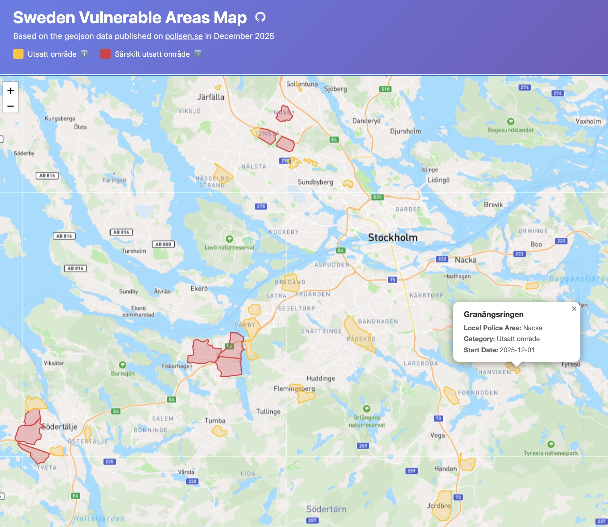

# Sweden Vulnerable Areas Map

A simple web application for visualizing vulnerable areas in Sweden based on official geojson data from the Swedish Police published on December 2025.



## Features

- **Display Vulnerable Areas**: Automatically loads and displays official vulnerable areas from the GeoJSON file
- **Color-Coded Categories**:
  - Yellow for "Utsatt område" (Vulnerable Area)
  - Red for "Särskilt utsatt område" (Especially Vulnerable Area)
- **Interactive Map**: Built with Leaflet.js and Mapbox, featuring zoom, pan, and detailed popup information
- **Area Information**: Click on any area to see:
  - Area name
  - Local Police Area
  - Category
  - Start Date
- **Informative Legend**: Hover over info icons to learn more about each category

## Data Source

The map displays data from the Swedish Police (Polisen) published on [polisen.se](https://polisen.se/om-polisen/polisens-arbete/utsatta-omraden/). You can download the GeoJSON file (`uso_2025.geojson`) that contains vulnerable areas across Sweden.

## Technical Details

- **Map Library**: Leaflet.js
- **Base Map**: Mapbox (requires access token)
- **Coordinate System**: Transforms EPSG:3006 (Swedish coordinate system) to WGS84 for web display
- **Styling**: Modern, responsive design with gradient header

## Setup

### Mapbox Access Token

This app uses Mapbox for the base map. You need to:

1. Create a free account at [Mapbox](https://www.mapbox.com/)
2. Get your access token from [Mapbox Access Tokens](https://account.mapbox.com/access-tokens/)
3. Copy the example config file and add your token:

   ```bash
   cp config.example.js config.js
   ```

4. Open `config.js` and replace `YOUR_MAPBOX_ACCESS_TOKEN_HERE` with your actual Mapbox access token:

   ```javascript
   const MAPBOX_ACCESS_TOKEN = 'pk.your_actual_token_here';
   ```

**Note:** The `config.js` file is gitignored and will not be committed to version control. This keeps your access token secure.

### Running with a Local Server

Start a local web server:

```bash
# Python 3
python -m http.server 8000

# Node.js (with http-server)
npx http-server

# PHP
php -S localhost:8000
```

Then open `http://localhost:8000` in your browser.

## File Structure

- `index.html` - Main HTML structure
- `styles.css` - Styling and layout
- `app.js` - Application logic and map functionality
- `uso_2025.geojson` - GeoJSON data of vulnerable areas in Sweden
- `config.example.js` - Example configuration file template
- `config.js` - Local configuration file (create from config.example.js, gitignored)

## License

This project uses geojson data from Polisen. Please refer to their terms of use for data usage guidelines.
